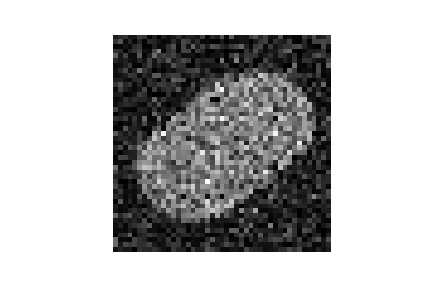

.. ##################################################################################
.. fri_curve.rst
.. =============
.. Author: Leo Serena [leo.serena@epfl.ch]
.. ##################################################################################

FRI Curve Reconstruction
========================

FRI Curve Reconstruction Theory
*******************************

Consider an interior image indicator associated with a curve

.. math::
    I_C (x,y) = \begin{cases}
                    1, (x,y) \in C^o \\
                    0, otherwise
                \end{cases}

where :math:`C^o` is the interior of the curve C.

The goal is to reconstruct the curve locations in continuous domain from a set of ideally lowpass filtered samples of the image :math:`I_C(x,y)`.

We know that the Wirtinger derivative (:math:`\partial = \frac{\partial}{\partial x} + j \frac{\partial}{\partial y}`) is a sum of sinusoids.

So the 2D Fourier transform of the derivative satisfies the anihilation equations.

.. math::
    c_{k,l} * \hat{\partial I}_{k,l} = 0

.. math::
    where\ \hat{\partial I}_{k,l} = (\frac{2 \pi k}{\tau_1} + j \frac{2 \pi l}{\tau_2}) \hat{I}_C(\frac{2 \pi k}{\tau_1},\frac{2 \pi l}{\tau_2})

The method is then basically the same as for :ref:`Irregular Time Sample Theory`.

FRI Curve Reconstruction Application
************************************

Let's see how to use the algorithm for reconstructing FRI Curves.

basic example
-------------

::

    from fri_oo.fri_curve import FriCurve as FRIC

    tau_x = 1            # period on x axis
    tau_y = 1            # period on y axis

    friCurve = FRIC(tau_x, tau_y) # instantiation

    M0 = 22              # number of samples in x axis
    N0 = 22              # number of samples in y axis
    P = 5                # SRN ratio in dB
    B_x = 25             # bandwidth in x axis
    B_y = 25             # bandwidth in y axis

    friCurve.setup(M0, N0, B_x, B_y, P) 

    friCurve.reconstruction(max_ini = 5, verbose = True)

*Proposed Approach*

*Standard deviation of the reconstructed curve coefficients error: 0.0618*

*SNR of the reconstructed curve coefficients: 24.0753[dB]*

::

    friCurve.save_results('friCurve')
    friCurve.plot()

