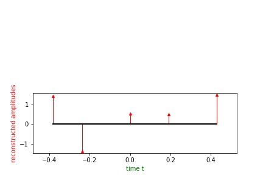

.. ##################################################################################
.. irr_four_samp.rst
.. =================
.. Author: Leo Serena [leo.serena@epfl.ch]
.. ##################################################################################

Irregular Fourier Sampling Reconstruction
=========================================

Irregular Fourier Sample Theory
*******************************

Suppose we have a signal

.. math::
    x(t) = \sum_{k = 1}^K a_k \delta (t - t_k)

It thus have a Fourier Transform

.. math::
    X(\omega) = \sum_{k=1}^K a_k e^{-j \omega t_k}

We now want to recover the signal :math`x(t)` from a number of measurements of :math:`X(\omega)`. 
If the measurements were uniformly sampled, we could directly use the inihilating filter but it isn't always the case.
We thus want an approach that performs on non-uniform samples. So we want to interpolate the measurements.

.. math::
    X(\omega) = \sum_{| m | \leq \lfloor \frac{M \tau}{2} \rfloor} X(\frac{2 \pi m}{\tau}) \psi ( \frac{\omega}{2 \pi / \tau} - m)

where :math:`\psi(.)` is a certain interpolation kernel.

By evaluationg the above at :math:`\omega_l`, we establish a linear mapping G between the the measurements **a** and the sampled signal
**b**.

We then perform the same algorithm as in the time domain. See :ref:`Irregular Time Sample Theory`.

Irregular Fourier Sample Application
************************************

Let's see how to use this algorithm for Fourier domain samples.
First, install the package, see :ref:`Installation` page.

noiseless case
--------------

Reconstruction setup::

    from fri_oo.irr_four_samp import IrrFourSamp as IFS

    K = 5                             # number of diracs
    M = 21                            # number of samples over the signal
    tau = 1.                          # period
    L = M                             # number of measurements

    IFS_noiseless = IFS(K, M, tau, L) # instanciation
    IFS_noiseless.setup()             # in this example we use the built-in sample generator
    IFS_noiseless.add_noise()         # we don't add any noise

Reconstruction::

    IFS_noiseless.reconstruction()    # this will perform the reconstruction with default parameters

*spectrum periodic, correcting interpolation kernel*

*Noise level: 1.00e-13*

*Minimum approximation error |a - Gb|_2: 2.00e-14*

The results can then be displayed with pandas using *show_results()*::

    IFS_noiseless.show_results()

+-------------+------------------+-------------+-------------------+
| original tk | reconstructed tk | original ak | reconstructed ak  |
+=============+==================+=============+===================+
|  -0.428571  |   -0.428571      | 1.133117    |     1.133117      |
+-------------+------------------+-------------+-------------------+
|  -0.333333  |   -0.333333      |-1.290417    |    -1.290417      |
+-------------+------------------+-------------+-------------------+
|  -0.238095  |   -0.238095      |-0.762772    |    -0.762772      |
+-------------+------------------+-------------+-------------------+
|  -0.190476  |   -0.190476      |-0.895557    |    -0.895557      |
+-------------+------------------+-------------+-------------------+
|   0.047619  |    0.047619      |-1.241257    |    -1.241257      |
+-------------+------------------+-------------+-------------------+

To recover the reconstructed :math:`a_k` and :math:`t_k`::

    ak = IFS_noiseless.ak_recon
    tk = IFS_noiseless.tk_ref

to plot the result (here we also have the original signal), we first save them::

    its_noiseless.save_results("ifs_noiseless")  # saved to the result file
    its_noiseless.plot()

To see how to manage results: :ref:`Data Management`

.. image:: ../_static/images/IFS_noiseless_diracs.jpg

.. image:: ../_static/images/IFS_noiseless_cont.jpg

noisy case
----------

::

    K = 5
    M = 21
    tau = 1.
    L = 2 * M                       # here we oversample since we will be adding noise
    P = 5                           # SNR ratio in dB

    IFS_noisy = IFS(K, M, tau, L)
    IFS_noisy.setup()
    IFS_noisy.add_noise(P = P)
    IFS_noisy.reconstruction()

*spectrum periodic, correcting interpolation kernel*

*Noise level: 8.90e+00*

*Minimum approximation error |a - Gb|_2: 8.12e+00*

::

    IFS_noisy.show_results()

+-------------+------------------+-------------+-------------------+
| original tk | reconstructed tk | original ak | reconstructed ak  |
+=============+==================+=============+===================+
|  -0.476190  |      -0.472445   | -1.313043   |      -1.470098    |
+-------------+------------------+-------------+-------------------+
|  -0.190476  |      -0.196718   |  0.548886   |       0.765750    |
+-------------+------------------+-------------+-------------------+
|   0.000000  |       0.003393   | -1.315494   |      -1.605295    |
+-------------+------------------+-------------+-------------------+
|   0.047619  |       0.054651   | -1.042315   |      -1.057258    |
+-------------+------------------+-------------+-------------------+
|   0.285714  |       0.291236   |  1.275741   |       1.398635    |    
+-------------+------------------+-------------+-------------------+

::

    IFS_noisy.save_results('ifs_noisy')
    IFS_noisy.plot()

.. image:: ../_static/images/IFS_noisy_diracs.jpg

parameterized reconstruction
----------------------------

In this example we will reconstruct the signal with given measurements and linear mapping G::

    K = 5                             # number of diracs
    M = 21                            # number of samples over the signal
    tau = 1.                          # period
    L = M                             # number of measurements

    IFS_param = IFS(K, M, tau, L) # instanciation
    IFS_param.setup(a = a)
    # a is the *(L x 2)* measurements matrix, with first row the frequencies and second row the amplitudes
    IFS_param.add_noise()         # we don't add any noise
    IFS_param.reconstruction(G = G) # G is the linear mapping as explained above in the theory part

    IFS_param.save_results('ifs_param')
    IFS_param.plot()

